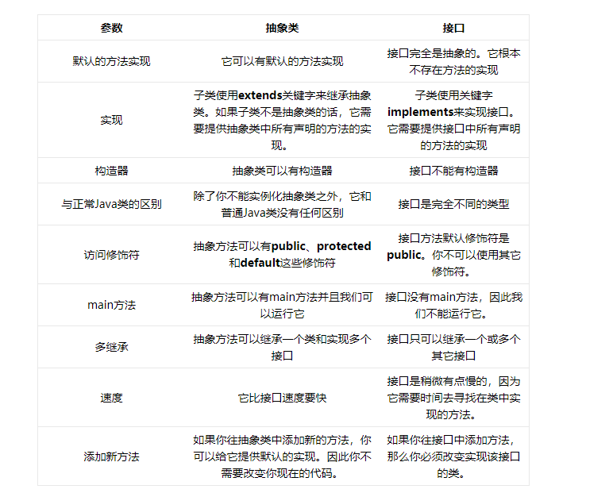

# 基础

## 基本内容

### 面向对象的特征
- 继承 多态 封装
- 多态的好处:可替换性 可扩充性 接口性 灵活性 简化性
- 多态的具体实现: 接口实现 继承父类 `方法重载`
- 多态的虚拟机实现: 动态绑定

### final, finally, finalize 的区别
- final用来修饰修饰方法
    - 把方法锁定，以防止继承类对其进行更改 `方法不可被重写`
- final用来修饰变量
    - final成员变量表示常量，只能被赋值一次，赋值后其值不再改变
    - string被设计为final的原因:安全性 效率
- finally 只能用于try/catch之中,会最终执行，会最终执行finally中return语句
- finalize定义在object中，`对象回收时调用`
    - 重载finalize方法,调用super.finalize();

### int 和 Integer 有什么区别

- int 基本类型(byte shrot char int long float double  boolean)
- Integer包装类型(Byte Shrot Character Integer Long Float Double  Boolean String)
- int 初始化为0 integer初始化为1 虚拟机会默认缓存-128~-127的数
- `装箱`的时候自动调用的是Integer的valueOf(int)方法
- `拆箱`的时候自动调用的是Integer的intValue方法。
```java
// 
Integer m = new Integer(10) //不会触发自动装箱
Integer i = 10;  //装箱
int n = i;   //拆箱
```

### 重载和重写的区别

- 重载发生在一个类中，重写发生在子父类中
- 重写
    - 发生在父类与子类之间 
    - 方法名，参数列表，返回类型（除过子类中方法的返回类型是父类中返回类型的子类）必须相同 
    - 访问修饰符的限制一定要大于被重写方法的访问修饰符（public>protected>default>private) 
    - 重写方法一定不能抛出新的检查异常或者比被重写方法申明更加宽泛的检查型异常
- 重载
    - 重载Overload是一个类中多态性的一种表现
    - 重载要求同名方法的参数列表不同(参数类型，参数个数甚至是参数顺序) 
    - 重载的时候，返回值类型可以相同也可以不相同。无法以返回型别作为重载函数的区分标准

```
方法的重载和重写都是实现多态的方式，区别在于前者实现的是编译时的多态性，而后者实现的是运行时的多态性。重载发生在一个类中，同名的方法如果有不同的参数列表（参数类型不同、参数个数不同或者二者都不同）则视为重载；重写发生在子类与父类之间，重写要求子类被重写方法与父类被重写方法有相同的参数列表，有兼容的返回类型，比父类被重写方法更好访问，不能比父类被重写方法声明更多的异常（里氏代换原则）。重载对返回类型没有特殊的要求，不能根据返回类型进行区分
```

### 抽象类和接口有什么区别
- jdk8以后接口可以有默认实现


### 说说反射的用途及实现
参考链接: https://www.cnblogs.com/rocomp/p/4781987.html
- 实现
    - Class.formName("类路径")
        - 这种会初始化class对象,会有一个ClassNotFoundException异常
    - .class 方法
        - 不会初始化class对象
    - 三个步骤
        - `加载` 由类加载器完成，找到对象的字节码信息，创建class对象
        - `链接` 验证类中字节码，为静态域分配空间
        - `初始化` 如果该类有超类，则对其进行初始化

- 用途
    - 获得Class对象
        - 使用Class类的forName静态方法 直接获取某一个对象的class 调用某个对象的getClass()方法
    - 判断是否为某个类的实例
        - 用instanceof关键字来判断是否为某个类的实例
    - 创建实例
        - 使用Class对象的newInstance()方法来创建Class对象对应类的实例
    - 获取方法
        - getDeclaredMethods()
    - 获取构造器信息
        - getDeclaredMethods()  getMethods() getMethod()
    - 获取类的成员变量（字段）信息
        - getFiled: 访问公有的成员变量
        -  getDeclaredField：所有已声明的成员变量。但不能得到其父类的成员变量
    - 调用方法
        -  invoke()
    - 利用反射创建数组
        - Array.newInstance()
    
```
由于反射会额外消耗一定的系统资源，因此如果不需要动态地创建一个对象，那么就不需要用反射。
另外，反射调用方法时可以忽略权限检查，因此可能会破坏封装性而导致安全问题。
```

### 说说自定义注解的场景及实现

- 登陆、权限拦截、日志处理
- 基本知识
    - 元注解
        - @Target 注解可用范围
            - CONSTRUCTOR：构造器的声明
            - FIELD：域声明（包括enum实例）
            - LOCAL_VARIABLE：局部变量声明
            - METHOD：方法声明
            - PACKAGE：包声明
            - PARAMETER：参数声明
            - TYPE：类、接口（包括注解类型）或enum声明
        - @Retention 编译范围
            - SOURCE 注解将被编译器丢弃
            - Class 注解在class文件中可用，但会被VM丢弃
            - RUNTIME VM将在运行期间保留注解，因此可以通过反射机制读取注解的信息。
        - @Document 将注解包含在Javadoc中
        - @Inherited 允许子类继承父类中的注解\

### HTTP 请求的 GET 与 POST 方式的区别

- 区别
    - GET在浏览器回退时是无害的，而POST会再次提交请求。
    - GET产生的URL地址可以被Bookmark，而POST不可以。
    - GET请求会被浏览器主动cache，而POST不会，除非手动设置。
    - GET请求只能进行url编码，而POST支持多种编码方式。
    - GET请求参数会被完整保留在浏览器历史记录里，而POST中的参数不会被保留。
    - 对参数的数据类型，GET只接受ASCII字符，而POST没有限制。
    - GET比POST更不安全，因为参数直接暴露在URL上，所以不能用来传递敏感信息。
    - GET参数通过URL传递，POST放在Request body中，参数长度限制不同

- 协议层区别
    - GET产生一个TCP数据包；POST产生两个TCP数据包。
 ```
 对于GET方式的请求，浏览器会把http header和data一并发送出去，服务器响应200（返回数据）；
而对于POST，浏览器先发送header，服务器响应100 continue，浏览器再发送data，服务器响应200 ok（返回数据）。
```
    